# Experimentation with AWS EMR Clusters vs Athena
**Author:** Marcel León Lafebré

This repo is organized as follow: 
- In the folder automatic_scrips are all the scrips used to exec experiments from a terminal.
- In the folder sql_queries are the queries of TPC-DS 1 TB or 3 TB used in this experiments.
- In the folder images are the figures used in this manual of instructions.

Below is the instruction manual.

**Introduction**

This guide lets scientist, researchers, students or industry people observe of hands-on experiments about the alternative with the use of EMR Clusters versus Athena to exec queries of Big Data. The experiments involve executing SQL queries on a data lake, using Apache Spark, Hieve and Presto on AWS EMR.

The following sections outline the teaching objectives of this guide and highlight the intended audience and prerequisites. This laboratory guide has been designed for execution within an AWS Account environment.

**Objectives**

This laboratory guide will teach you how to:
* Use AWS services such as Athena and EMR to analyze large data volumes.
* Prepare an environment for benchmarking a Big Data platform with the benchmark
“TPC-DS” on AWS.
* Launch an Elastic MapReduce (EMR) cluster through Automatic Scripts.
* Execution of the experiments.

**Prerequisites**

We recommend that people have prior knowledge of Distributed Systems and Big Data concepts, as well as familiarity with AWS services and AWS Command Line Interface to run the Lab Environment. Furthermore the features of EC2 in order to creation of rules to enable server ports and access from specific IPs, as well as using key pairs to access the nodes. You can refer to the Appendix section if needed.

# Sections
This guide has the following key sections:
1. [Process for setting up an environment with TPC-DS in AWS for benchmarking Big Data querying platforms.](#process-for-setting-up-an-environment-with-tpc-ds-in-aws-for-benchmarking-big-data-querying-platforms)
2. [Launch an Elastic MapReduce (EMR) cluster through Automatic Scripts.](#configure-and-run-an-emr-cluster-with-access-to-the-tpc-ds-big-data-repository)
3. [Observe the logs of experiments.](#observe-the-scalability-of-an-emr-cluster)
4. [Appendix: Pre-requisite knowledge; refer to this section if it is unclear how to execute one or more steps in the guide.](#appendix-pre-requisite-knowledge;-refer-to-this-section-if-it-is-unclear-how-to-execute-one-or-more-steps-in-the-guide)
   
## Process for setting up an environment with TPC-DS in AWS for benchmarking Big Data querying platforms

This exercise must be carried out in an AWS Academy Learner Lab environment. First, you
need to set up an S3 bucket and configure Athena, as described below:

1\. Create an **Amazon S3 bucket** using S3 service with default permissions and the name that
you decide (being a string unique in your environment), for example, **_“athenabucketmll”_** where
you could replace **_“mll”_** with the initials of your name.

The following image shows the S3 bucket created.
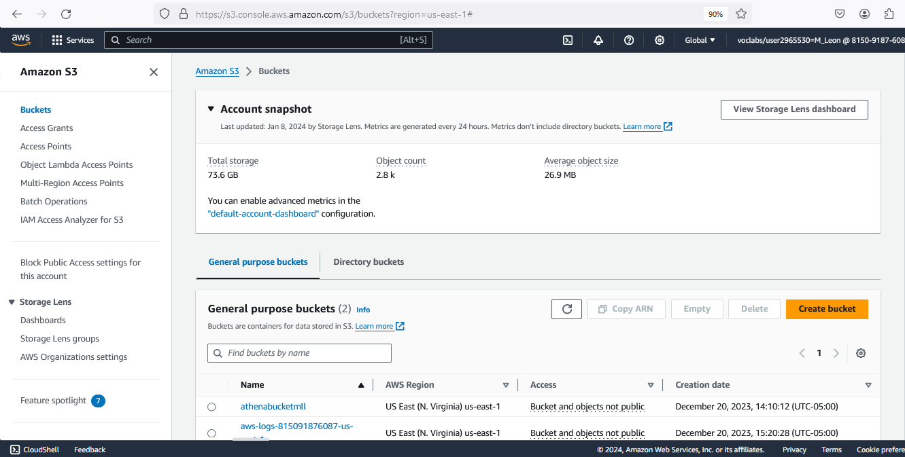
2\. Go to the Athena Service and access the SQL query editor, then you have to configure it
using **_"Edit Settings"_**. Assign the bucket created in the field query result location, note that you
can write the location or select it in a search.
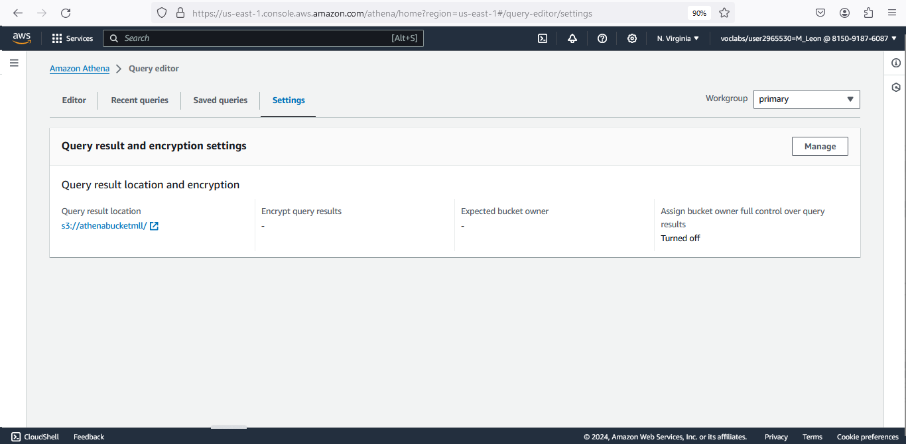
Once Athena is configured, continue with the following steps of the lab:

3\. This work uses the official repository of [AWS Labs for Redshift utils](https://github.com/awslabs/amazon-redshift-utils/tree/master/src/CloudDataWarehouseBenchmark/Cloud-DWB-Derived-from-TPCDS/1TB), specifically employing
the **_1 TB TPC-DS_** which is an industry-standard benchmark to evaluate the performance of
systems for big data analytics; it simulates the data and typical queries of the data warehouse,
offering different sizes of information. In summary, it provides data to test systems
related to information consumption with Big Data queries. The script file ddl.sql contains the
commands to create the database tables on Redshift, an AWS product designed for storing
large data volumes but in this case, you will adapt to run in Athena as a datasource.

4\. These tables are created as files stored on S3. For this, you will use Athena to execute the
scripts, but you need to make a few changes first.
* Create a database with the following code:
```
CREATE DATABASE tpcds_1tbrs;
```
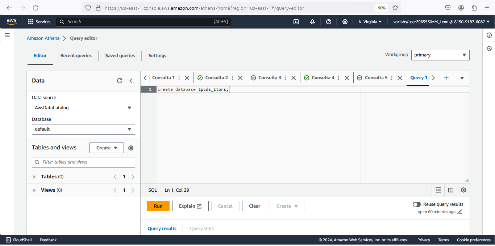

5\. The ddl.sql file located in the link of the previous step contains CREATE statements for the tables, which you should modify as indicated from this until the 9 step and repeat for every table. **We recommended read or following the steps to understand the changes at least once, but if you consider, you can use the following file with the scripts https://github.com/marcelleonlafebre/lab_manualcloud/blob/main/tables.sql to create every table in Athena and go directly to step 10**:
* In each **“CREATE”** statement, replace **“CREATE TABLE”** with **"create external
table"**. This is needed because the data files are stored in an external bucket that you
do not own.

6\. Inside the CREATE statement you will find the definition of each field of the table with its
name followed by the datatype. You will modify:
* The data types **_"integer"_**, **_"int8"_** or **_"int4"_** by **_"int"_**, and
* The data types **_"numeric"_** by **_"decimal"_** with the same precision described after the data
type inside parenthesis.

This is needed because are the data types accepted by Athena.
7\. Also, inside the CREATE statement you will have to modify the following:
* **_Delete_** the **_definitions_** of **_"primary key"_** because Athena does not enforce primary keys.
* **_Delete_** the **_null fields_** **_definitions_** to match with the data of the benchmark TPC-DS.
* **_Delete_** the following **_declarations: diststyle, distkey_**, and **_sortkey_** because they are
specific commands for Redshift.
Insert the following **_code block_** at the end with important properties of the tables as the
format or compression type. You have to refer to the link of the S3 file published by the
TPC-DS framework for the data population e.g.
s3://redshift-downloads/TPC-DS/2.13/1TB/**_date_dim_**/. Take into account that the file
name (in bold and italic: date_dim) changes depending on the table and the link must go
between quotes.
```
ROW FORMAT SERDE 'org.apache.hadoop.hive.serde2.lazy.LazySimpleSerDe'
WITH SERDEPROPERTIES ('field.delim' = '|')
STORED AS INPUTFORMAT 'org.apache.hadoop.mapred.TextInputFormat'
OUTPUTFORMAT 'org.apache.hadoop.hive.ql.io.HiveIgnoreKeyTextOutputFormat'
LOCATION 's3://redshift-downloads/TPC-DS/2.13/1TB/date_dim/'
TBLPROPERTIES (
  'classification' = 'csv',
  'write.compression' = 'GZIP'
);
```
For example, the following code is similar to the original file and highlights the words to change:\
create table tabla_ejemplo(\
&emsp;field1 **integer**,\
&emsp;field2 **int8**,\
&emsp;field3 **int4**,\
&emsp;field4 **numeric**(4,2));
   
The following text shows the example of the final script highlighting in bold the words added or
changed:
```
create external table tabla_ejemplo(
field1 int,
field2 int,
field3 int,
field4 decimal(4,2))
ROW FORMAT SERDE 'org.apache.hadoop.hive.serde2.lazy.LazySimpleSerDe'
WITH SERDEPROPERTIES ('field.delim' = '|')
STORED AS INPUTFORMAT 'org.apache.hadoop.mapred.TextInputFormat'
OUTPUTFORMAT 'org.apache.hadoop.hive.ql.io.HiveIgnoreKeyTextOutputFormat'
LOCATION 's3://redshift-downloads/TPC-DS/2.13/1TB/tabla_ejemplo/'
TBLPROPERTIES ( 'classification' = 'csv', 'write.compression' = 'GZIP'
);
```
8\. The script will run in Athena and must reply **_“Query successful”_**.
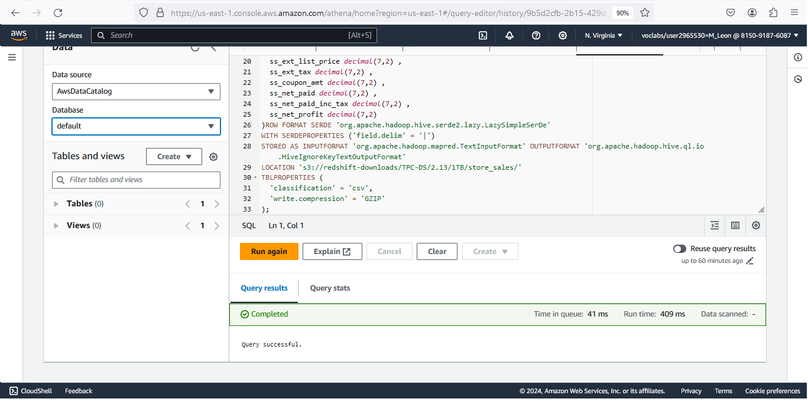

9\. Repeat the modification of the script and its execution for every table of the TPC-DS
repository, ensuring that database tpcds_1tbrs is selected in the combo box labeled Database.
In our experiment, we initially will create five tables: **date_dim, item, inventory, and
warehouse**, which are used in **query number 21** in this repository https://github.com/awslabs/amazon-redshift-utils/tree/master/src/CloudDataWarehouseBenchmark/Cloud-DWB-Derived-from-TPCDS/1TB/queries.

The script of query number 21 has been chosen as a goal of running it because in the following
research was not possible to execute it in an EMR Cluster with Spark:
https://www.concurrencylabs.com/blog/starburst-enterprise-vs-aws-emr-sql-tpcds/. However,
you can use any query that takes at least 3 minutes in Athena.

10\. After executing the previous steps, the tables will be ready to be accessed via the data
source type: AWS Glue Data Catalog, enabling the TPC-DS data to be accessible from the
EMR Clusters by only marking the check of one property when you create the cluster.

## Configure and run an EMR Cluster with access to the TPC-DS Big Data repository
Before continuing to the following steps, you can refer to the official documentation on the
architecture of the EMR Cluster service for a thorough understanding. Next are two links that we
suggest that you read if you do not know the EMR Cluster service:
https://docs.aws.amazon.com/emr/latest/ManagementGuide/emr-overview-arch.html\
https://docs.aws.amazon.com/emr/latest/ManagementGuide/emr-what-is-emr.html\
The EMR Cluster service supports technologies such as Hadoop, Presto, or Spark. In this lab,
we will use Apache Spark, as it is one of the most commonly used Big Data platforms in the
industry.

Here are the steps you need to follow to set up an EMR Cluster for Apache Spark:\
1\. Click **_"Create Cluster"_** to initialize the EMR Cluster service. Then, enter a name for the
cluster, and select the **_default_** version of the EMR Cluster, which generally is the last version
released by the service. Then, proceed to select the **_"Spark Interactive"_** application package.

2\. Mark the check **_“Use for Spark table metadata”_** to connect the cluster with the data layer
created in the previous section "Process for setting up an environment with TPC-DS in AWS for
Benchmarking Big Data platforms".
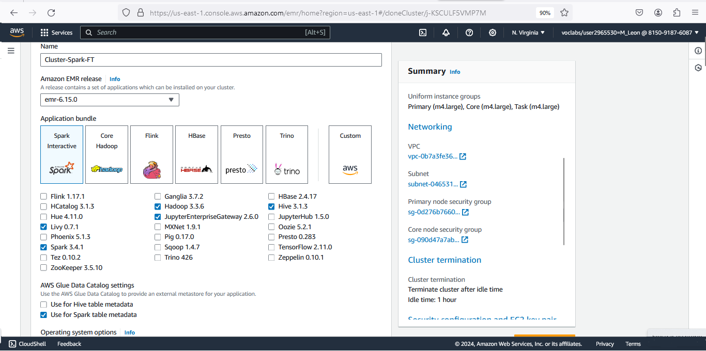
3\. Configure the **_service role_** and **_instance profile_** role choosing **_default roles_**.

4\. Configure the provisioning of nodes for the cluster using the **_“Add task instance group”_**
button to create more task nodes. To consider the restrictions of using the EMR tool within an
AWS Lab Environment which are the following:
| **Restriction** | **value** |       
| ------------------------------ | --------- |  
| **Max.vCPU** | 32 concurrent running |
| **Max.number of nodes** | 9 concurrent running |
| **EC2 Instance size** | large o smaller |

> Note that "large" EC2 instances have 8 GB of memory RAM, which is important as
Apache Spark relies on memory as its primary resource, resulting in accelerated loading
of tables and execution of operations. You can go to this link to review Apache Spark:
https://aws.amazon.com/es/what-is/apache-spark/.
With the mentioned restrictions you can only create **_7 task nodes_** of **_instance type
m4.large_** as shown in the following image:


4\. Finally, the cluster has been created with the following information:

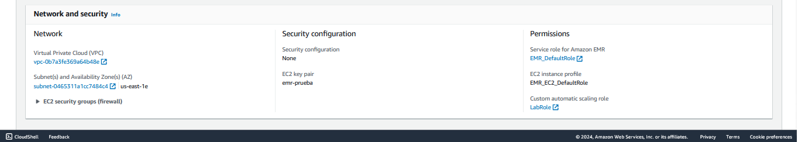

> Note: Don’t forget to choose the key-pair and enable access to the core node of the
cluster by enabling access to the SSH port from your IP, using an inbound rule as
indicated in the appendix section.

Here is the summary of configurations to consider in the cluster creation:
| **Config file attribute name** | **value** |       
| ------------------------------ | --------- |      
| **spark version** | Default version |
| **Amazon EC2 key pair for SSH to the cluster** | Select the name of your EC2 key pair |
| **Additional security groups for primary node (firewall)** | Select the name of the security group created |
| **Instance-type**      | m4.large |
| **region** | Your test region. Make sure the source data has been copied to the test region. For example: `us-east-1`|
| **Service role** | `EMR_DefaultRole` By default. 
| **Instance profile** | `EMR_EC2_DefaultRole` Make sure this role exists in your account. By default EMR creates this role when launched on the Management console. You can manually create this role by running: `aws emr create-default-roles` Please refer the [CLI doc](https://docs.aws.amazon.com/cli/latest/reference/emr/create-default-roles.html). |
| **Quantity of task nodes**         | 7                                           |
| **Quantity of primary nodes**         | 1                                           |
| **Quantity of core nodes**         | 1                                           |

Once the cluster is in the **_“waiting” state_** you must connect via SSH to the main node with the
following command in a terminal window; don’t forget to replace the name of the key pair file
with the full path of your computer and the file name of your key-pair and connect to the IP
address of the **_primary node public DNS_** of the cluster:
```
ssh -i emr-keypair.pem ec2-user@IP address of the primary node public DNS.
```
If you can not connect to your cluster, go to the **_ec2 instance_** and set the appropriate **_inbound
rule_**, as indicated in the [Appendix](#appendix:-pre-requisite-knowledge;-refer-to-this-section-if-it-is-unclear-how-to-execute-one-or-more-steps-in-the-guide).

## Observe the scalability of an EMR cluster
Scalability is the ability of computer systems to generally increase but also decrease
components to changes in processing demands for solving tasks (Sehgal, N. K., Bhatt, P. C. P.,
& Acken, J. M., 2023).

To demonstrate the scalability in our exercise we will do two manual experiments: first, you will
have to exec the query of this guide in an EMR Cluster with a x number of nodes and then another execution with more number of nodes so the time of execution of the same query should be better due to greater amount of resources.

Remember when you create the EMR Cluster to use the security group and to link the key-pair,
both created previously in the experiments and review your public IP is configured in the
inbound rules.

In any case, below are 2 illustrative images of the creation of the cluster:
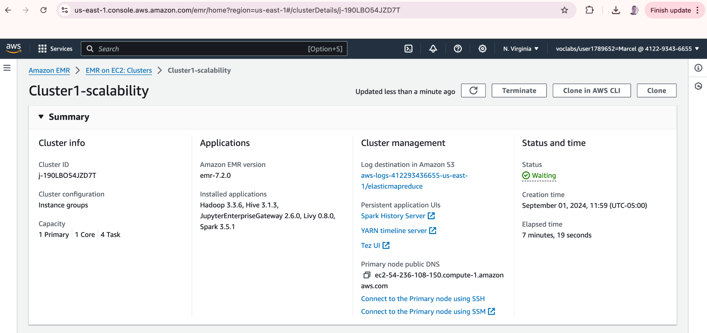
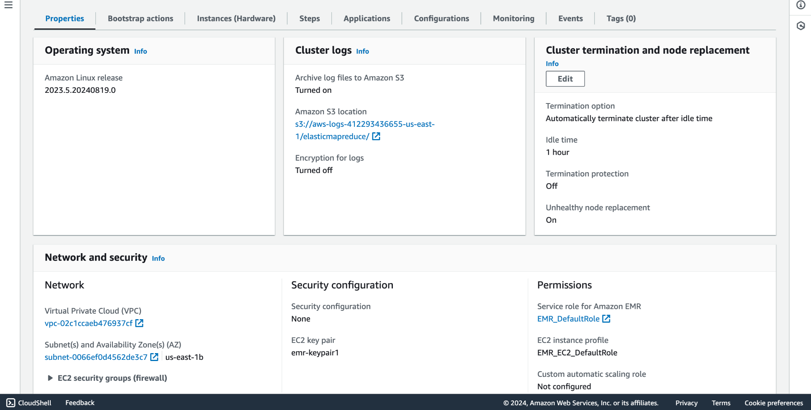
Then, when the cluster is in a **_“waiting” state_** you will enter the cluster through the terminal as
explained in the section **_“Configure and run the EMR cluster with access to the TPC-DS Big
Data repository”._**\
Next, you have to execute the commands described in the section **_“Observe the fault
tolerance behavior in an EMR cluster using redundancy”_**.

Now, you must execute the query 21 adapted in a cluster with only 4 task nodes and you will
note the time taken for execution is 224 seconds which is almost 4 minutes.
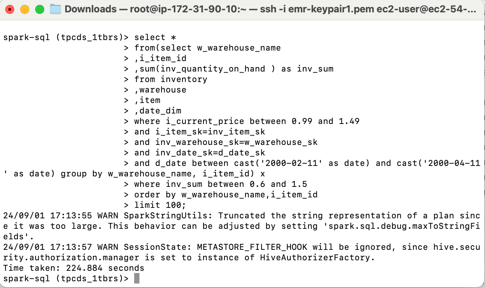
Then you have to **_terminate the cluster in the AWS Console_**.\
For the second part of the experiment, you will create a new EMR Cluster but now with the 7
task nodes, which as we saw before is the maximum size of the cluster because of the
restrictions of use of the lab environment and you will connect through the terminal to its public
IP.\
Finally, you must repeat the step of the query but now in a cluster with 7 worker nodes, you will
note the time taken for execution is 186 seconds reducing the time of execution by 17 percent.
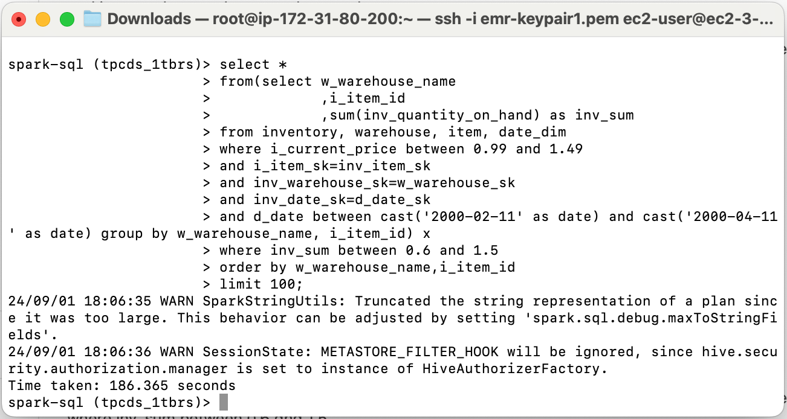
This is how it has demonstrated the concept of scalability using an EMR cluster in a Big Data
environment, that is, with a greater number of nodes, the execution time of the same task is
shorter.

## Appendix: pre-requisite knowledge; refer to this section if it is unclear how to execute one or more steps in the guide.

To run this experiment in an AWS lab environment, you have to access with your email registered
as **_username_** and your **_password_** to the site https://awsacademy.instructure.com/login/canvas.
Then, in the **_control panel section_**, you need access to the course **_“AWS Academy Learner
Lab [82952]”_**. Next, you must click in the **_“Modules”_** menu and scroll down to enter the section
**_“Launch AWS Academy Learner Lab”_**. Finally, you have to click on the button **_“Start
Lab”_** until the AWS console is green color for launching the console with a click in the **_“AWS”_**
button.
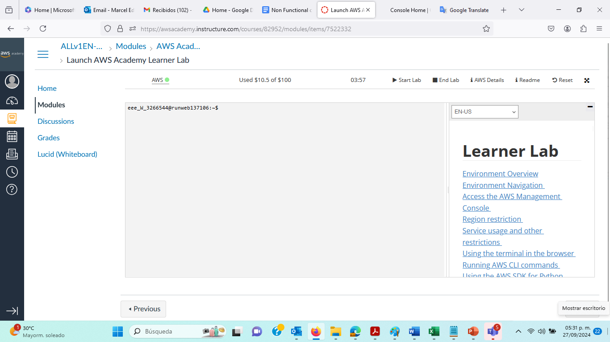
Here are the steps to help with configurations needed in this lab:
1\. The first step is to create a key pair in the AWS console using the key pairs service:
you have to create a key pair by putting it a name, in this case, called “emr-keypair”
being of RSA type and “.pem” file format. Then you have to download the file for future
usage. The keypair is shown in the console in the following image:
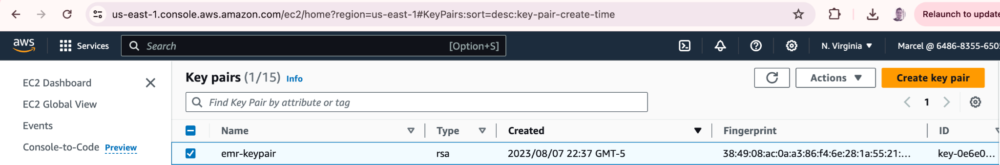
> Note: Remember to assign the permissions to the file .pem with the command chmod
400 for Linux or Mac.

2\. You will use this key pair when you have to connect to the master node of the EMR
Cluster in this lab. The file is displayed as follows in the visual operative system:
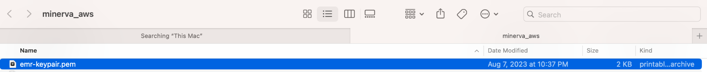
3\. The second step is to create the security group using the service “Security Groups” for
EC2 with the objective that only you have permission to connect to the master node of
the EMR cluster. You need to assign a name, “ssh-my-ip” and select the default VPC
(virtual private cloud). Just make sure the VPC is in the same zone and region of AWS.
4\. You must create an inbound rule with your IP address as the source, allowing traffic
on port 22 for the SSH protocol. The information created automatically by AWS as ID is
important to use when you create the cluster being the security group ID and subnet ID
generated by default.
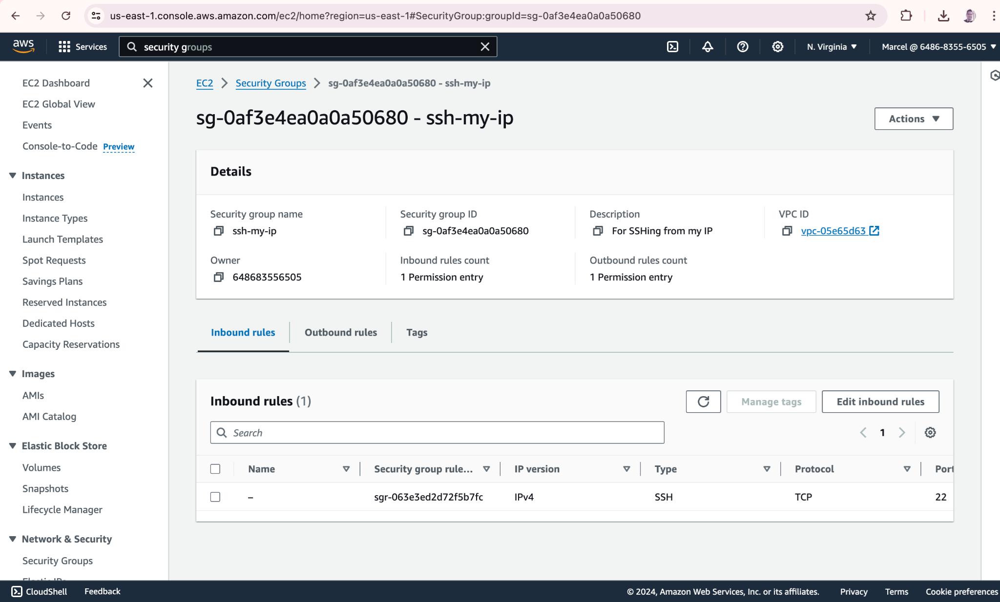
Final and important note: Remember to terminate the EMR cluster after running this laboratory
guide and delete the disk volumes created by default to save costs.

Well done! You used the Amazon EMR service to demonstrate the non-functional properties of
distributed systems like fault-tolerance and auto-scaling through the running of the Spark
Cluster connected to a TPC-DS big data repository in S3.
